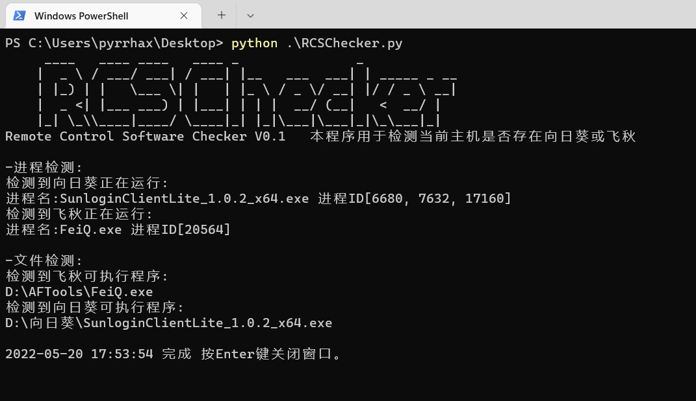

# RCSChecker
Remote control software Cheker could check whether the remote control software is installed on your machine. In fact, you can use it to check whether any specific software is installed on the machine by modifying the rule base.

## 中文介绍

## 功能
- RCSChecker用于检查本机是否安装了远程控制软件。
- 也可以通过修改规则库用它检查本机是否安装了任意指定软件。
## 使用说明
- 支持python3,使用```python RCSChecker.py``` 即可运行
- 也可以在release中直接下载使用pyinstaller打包好的exe
- 默认规则库中仅支持检测飞秋，向日葵
## 运行截图

